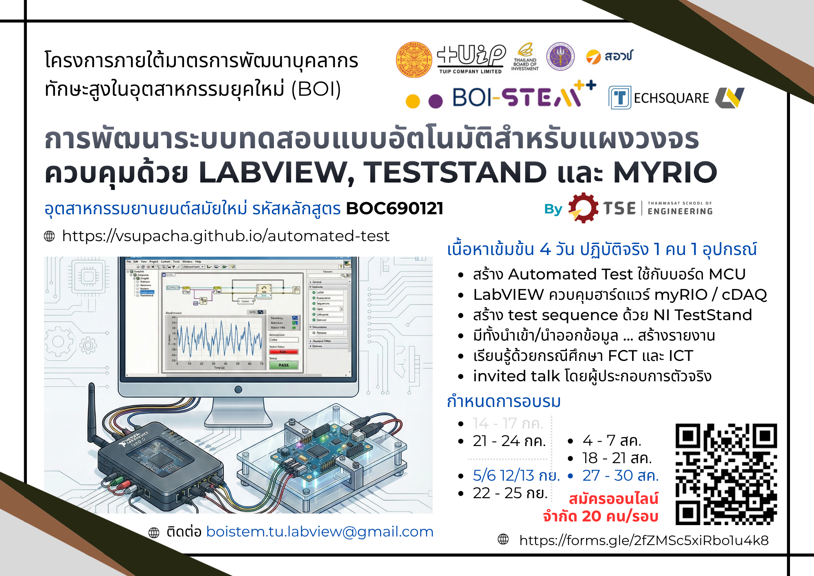

# Repository สำหรับคอร์สอบรม การพัฒนาระบบทดสอบแบบอัตโนมัติสำหรับแผงวงจรควบคุมด้วย LabVIEW, TestStand และ myRIO
Repository นี้เป็นการรวบรวมเนื้อหาและตัวอย่างของคอร์สอบรม **การพัฒนาระบบทดสอบแบบอัตโนมัติสำหรับแผงวงจรควบคุมด้วย LabVIEW, TestStand และ myRIO** รหัสหลักสูตร **B0C690121** สนับสนุนภายใต้กรอบโครงการพัฒนาบุคคลากรทักษะสูงสำหรับอุตสาหกรรมยุคใหม่ (BOI STEM++) ที่ได้รับคำขอรับการส่งเสริมเลขที่ C690011 ลงวันที่ 4 มิถุนายน 2569

การอบรมแบ่งออกเป็น 7 รอบ (จำกัด 20 คน/รอบ) โดยสมัครผ่านช่องทาง Google Forms: https://forms.gle/2fZMSc5xiRbo1u4k8 
- วันที่ 14 – 17 กรกฎาคม 2569-
- วันที่ 21 – 24 กรกฎาคม 2569
- วันที่ 4 – 7 สิงหาคม 2569 
-	วันที่ 18 – 21 สิงหาคม 2569 
- วันที่ 25 – 28 สิงหาคม 2569 
-	วันที่ 8 – 11 กันยายน 2569
- วันที่ 22 – 25 กันยายน 2569

## หลักการและเหตุผล
แผงวงจรควบคุมเป็นองค์ประกอบที่ควบคุมการทำงานของยานยนต์สมัยใหม่ จึงต้องผ่านการยืนยันสัญญาณ/ลำดับขั้น/จังหวะเวลาของการทำงานที่แม่นยำและน่าเชื่อถือ  หลักสูตรนี้สอนการพัฒนาระบบทดสอบแบบอัตโนมัติครบวงจร ตั้งแต่โครงสร้างทางฮาร์ดแวร์ในส่วน Test Fixture สัญญาณทดสอบมาตรฐาน การเขียนซอฟต์แวร์ด้วย LabVIEW เพื่อควบคุม myRIO สร้าง/วัดสัญญาณทั้งแอนะล็อกและดิจิทัล จนถึงการจัดการลำดับการทดสอบ/รายงานด้วย TestStand เพื่อรับรองความถูกต้องของแผงวงจรควบคุมได้

## เนื้อหาของหลักสูตร
### การบรรยาย
เนื้อหาภาคบรรยายแบ่งออกเป็น 3 ส่วนหลัก ได้แก่ 

1. หลักการและองค์ประกอบของระบบทดสอบแบบอัตโนมัติสำหรับแผงวงจรควบคุม โดยครอบคลุมตั้งแต่ Test Fixture ที่เป็นการเชื่อมโยงทางไฟฟ้าจากระบบทดสอบกับแผงวงจรที่จะถูกทดสอบ อุปกรณ์สำหรับสร้าง/วัดสัญญาณ และซอฟต์แวร์ที่เกี่ยวข้อง 
2. หลักการและเทคนิคการพัฒนาซอฟต์แวร์ด้วย LabVIEW เพื่อทำให้เกิดการเชื่อมต่อฮาร์ดแวร์ที่มีลำดับและจังหวะเวลาแม่นยำตามข้อกำหนด
3. หลักการทำงานของ NI TestStand เพื่อกำหนดลำดับและเวลาในการเรียกใช้ VI ที่พัฒนาด้วย LabVIEW การกำหนดเงื่อนไข PASS/FAIL และการสร้างรายงาน

### การฝึกปฏิบัติ
ผู้เข้าอบรมจะได้ฝึกปฏิบัติด้วยโปรแกรม LabVIEW และอุปกรณ์ myRIO แบบ 1 คน/1 ชุด เพื่อให้สามารถเรียนรู้จากการได้ปฏิบัติจริงอย่างเต็มที่

1. การฝึกปฏิบัติจะดำเนินการหลังการบรรยายแต่ละช่วง เพื่อให้ผู้เข้าอบรมทำความเข้าใจเนื้อหาที่ฟังจากการบรรยาย
2. หัวข้อสุดท้ายของการอบรมจะเป็นการทดลองกับแผงวงจรควบคุมที่ถูกโปรแกรมให้ทำงานผิดพลาดไม่ซ้ำกัน ซึ่งผู้เข้าอบรมแต่ละคนจะต้องประยุกต์สิ่งที่ได้เรียนรู้เพื่อตรวจสอบและยืนยันจุดที่ผิดพลาด

### ฮาร์ดแวร์สำหรับการเรียนรู้/ฝึกฝน
1. [บอร์ด NI myRIO-1900](https://docs-be.ni.com/bundle/myrio-1900-getting-started/raw/resource/enus/376047d.pdf) 
2. โปรแกรม [LabVIEW](https://www.ni.com/en/shop/labview), [NI TestStand](https://www.ni.com/en/shop/electronic-test-instrumentation/application-software-for-electronic-test-and-instrumentation-category/what-is-teststand), และ LabVIEW myRIO Toolkit รุ่น 2021SP1
3. อุปกรณ์ DUT: [บอร์ด Raspberry Pi Pico 2W](https://www.raspberrypi.com/products/raspberry-pi-pico-2/), [บอร์ด Gravity: Expansion Board for Raspberry Pi Pico / Pico 2](https://www.dfrobot.com/product-2393.html), และ [บอร์ด ET-34x2 TO 34x2T](https://www.etteam.com/Catalog2014/THAI/ETT_CATALOG_2014.pdf)
4. เฟิร์มแวร์: [LabVIEW compatible instrument on a Raspberry Pico](https://github.com/jancumps/pico_scpi_usbtmc_labtool)

## ความร่วมมือกับภาคอุตสาหกรรม
- [บริษัท บริษัท เทคสแควร์ จำกัด](https://www.ni.com/partners/s/partner/aDx3q000000KzAvCAK/techsquare-co-ltd?language=en_US) ร่วมพัฒนาหลักสูตรและเป็นวิทยากรในหัวข้อกรณีศึกษาในภาคอุตสาหกรรมอิเล็กทรอนิกส์ของประเทศไทย
- [บริษัท Ultest-Vicomm T&A (Thailand)](https://www.ni.com/partners/s/partner/aDxVU0000003B8b0AE/ultestvicomm-ta-thailand-co-ltd?language=en_US) ร่วมพัฒนาหลักสูตรและเป็นวิทยากรในหัวข้อกรณีศึกษาในภาคอุตสาหกรรมอิเล็กทรอนิกส์ของไต้หวัน
